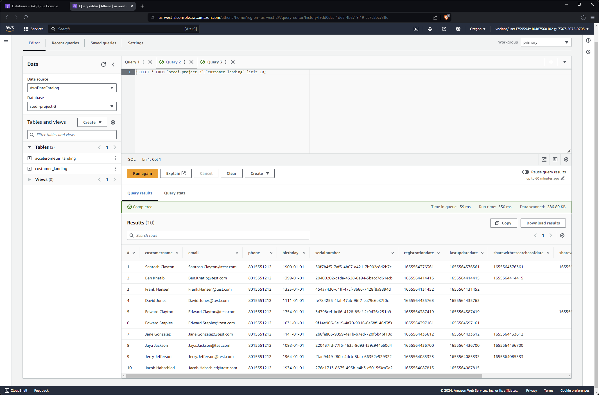
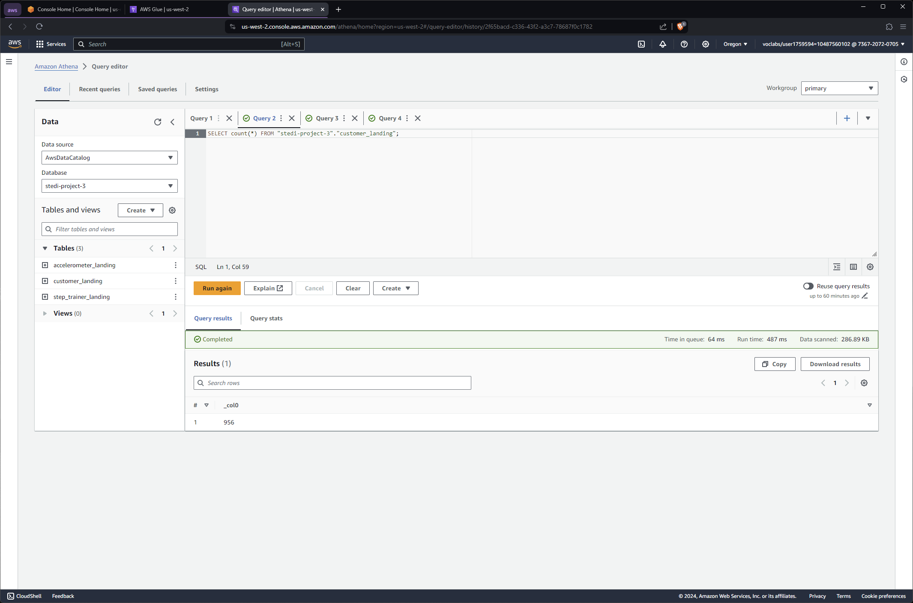
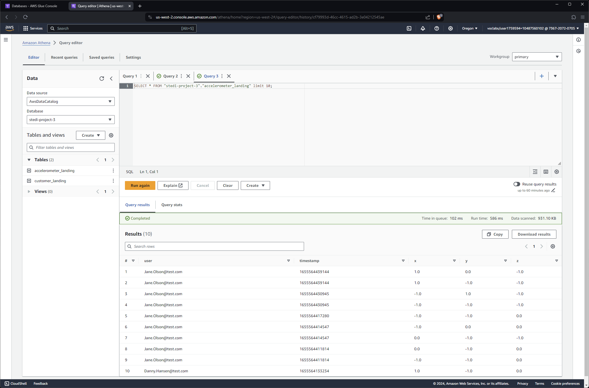
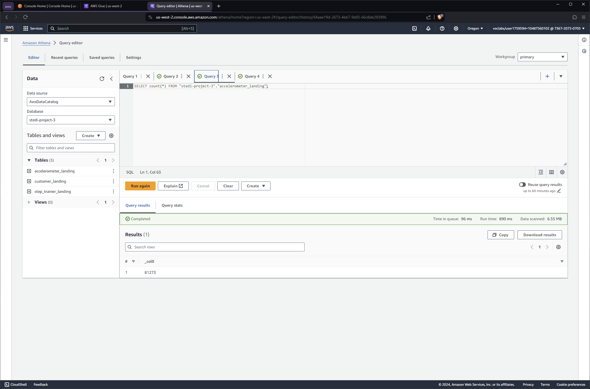
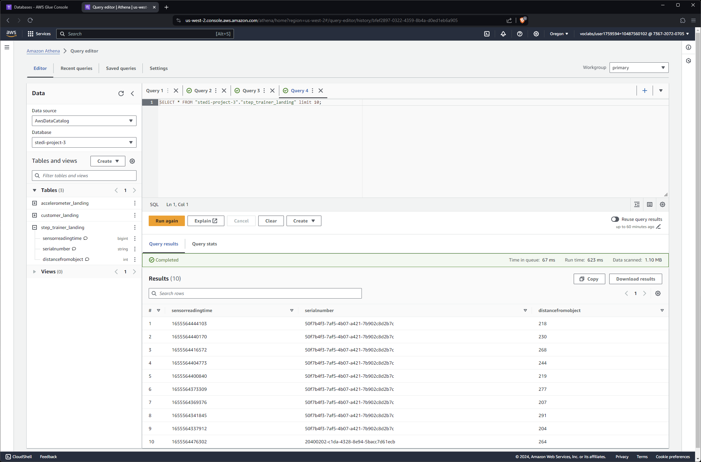
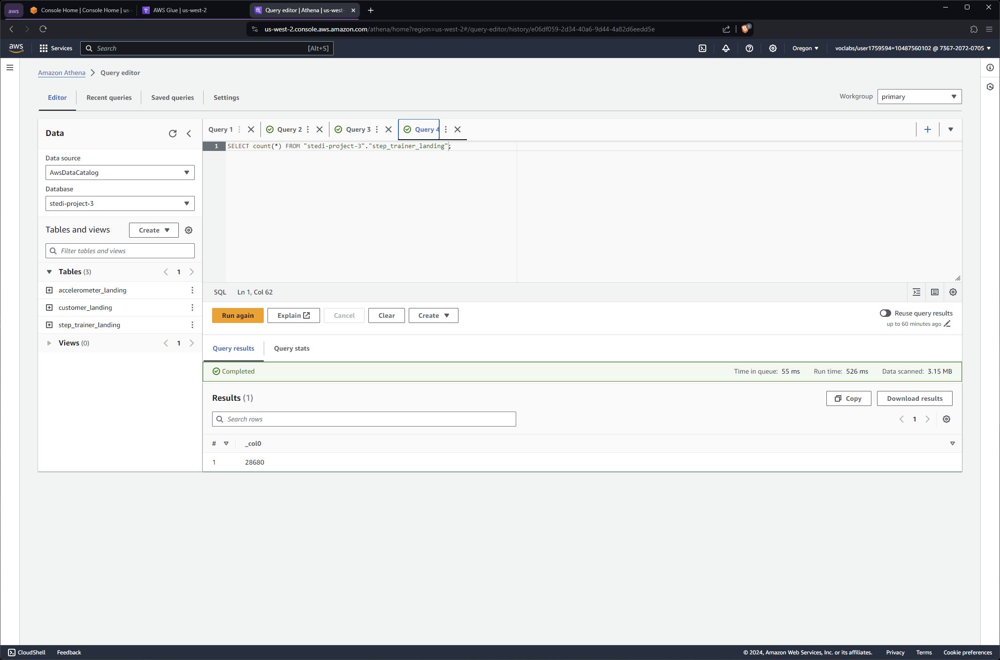
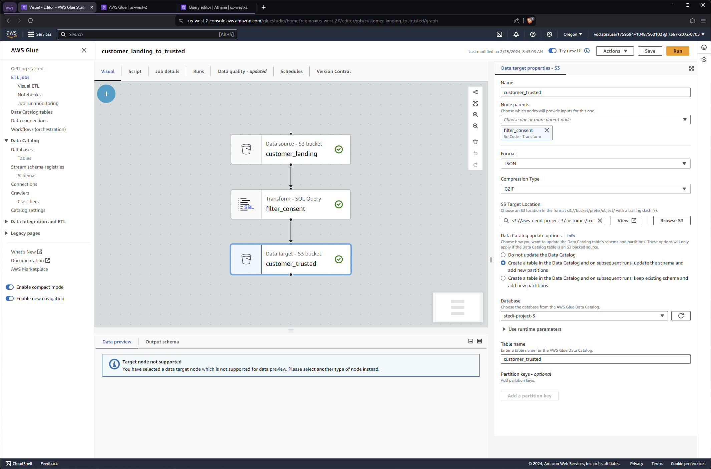
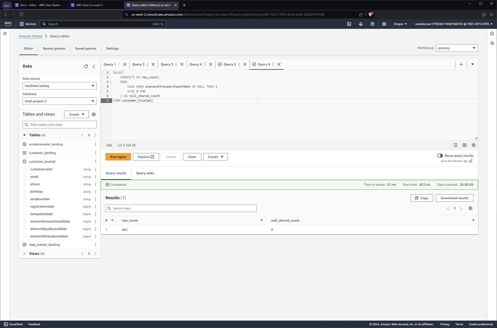
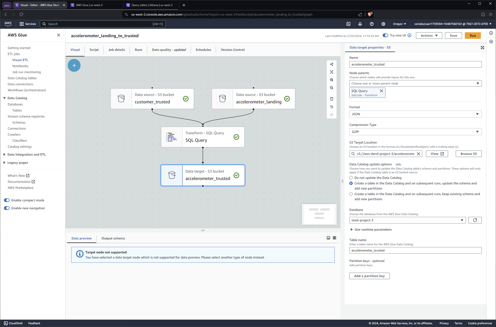
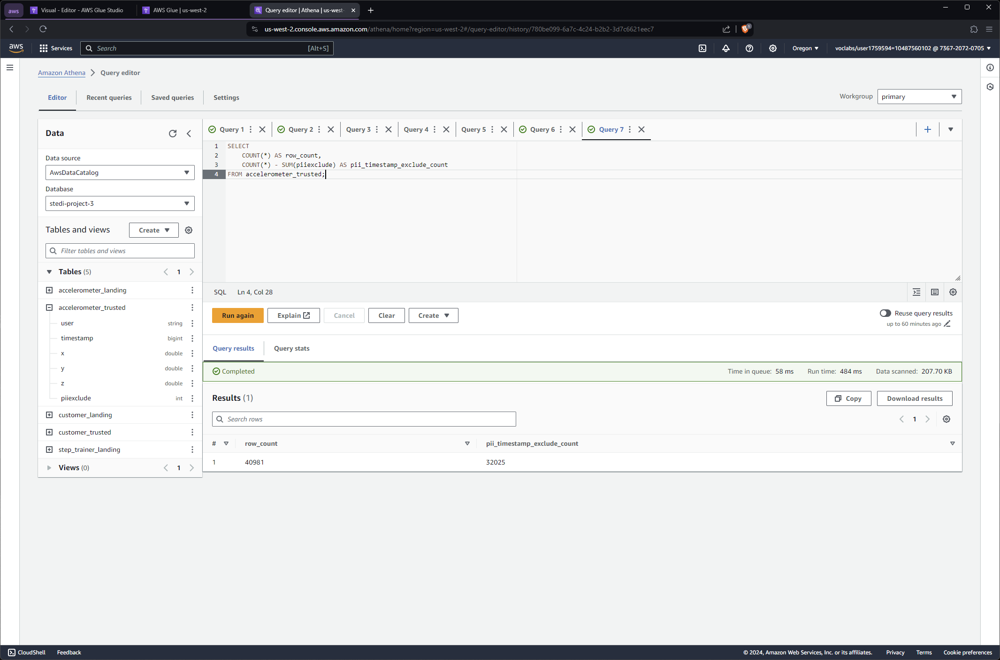

# Project Overview

# Procedure

## 1. Upload Raw Data to S3

First, the raw data must be uploaded to S3, into landing zones. A script is created to do this automatically via the aws cli.

Issue the following command from the project's root directory: 
```sh 
sh scripts/upload_data_to_s3.sh
```

*Note:* The target bucket may be changed by modifying the `S3_BUCKET` variable in the script.

<details>
  <summary>Output</summary>

    
    Cloning into '/tmp/nd027-Data-Engineering-Data-Lakes-AWS-Exercises'...
    remote: Enumerating objects: 1828, done.
    remote: Counting objects: 100% (182/182), done.
    remote: Compressing objects: 100% (105/105), done.
    remote: Total 1828 (delta 82), reused 141 (delta 67), pack-reused 1646
    Receiving objects: 100% (1828/1828), 30.80 MiB | 8.57 MiB/s, done.
    Resolving deltas: 100% (1431/1431), done.
    upload: ../../../../tmp/nd027-Data-Engineering-Data-Lakes-AWS-Exercises/project/starter/accelerometer/landing/accelerometer-1691348232031.json to s3://aws-dend-project-3/accelerometer/landing/accelerometer-1691348232031.json
    upload: ../../../../tmp/nd027-Data-Engineering-Data-Lakes-AWS-Exercises/project/starter/customer/landing/customer-1691348231425.json to s3://aws-dend-project-3/customer/landing/customer-1691348231425.json
    upload: ../../../../tmp/nd027-Data-Engineering-Data-Lakes-AWS-Exercises/project/starter/accelerometer/landing/accelerometer-1691348231724.json to s3://aws-dend-project-3/accelerometer/landing/accelerometer-1691348231724.json
    upload: ../../../../tmp/nd027-Data-Engineering-Data-Lakes-AWS-Exercises/project/starter/accelerometer/landing/accelerometer-1691348231881.json to s3://aws-dend-project-3/accelerometer/landing/accelerometer-1691348231881.json
    upload: ../../../../tmp/nd027-Data-Engineering-Data-Lakes-AWS-Exercises/project/starter/accelerometer/landing/accelerometer-1691348231445.json to s3://aws-dend-project-3/accelerometer/landing/accelerometer-1691348231445.json
    upload: ../../../../tmp/nd027-Data-Engineering-Data-Lakes-AWS-Exercises/project/starter/accelerometer/landing/accelerometer-1691348231810.json to s3://aws-dend-project-3/accelerometer/landing/accelerometer-1691348231810.json
    upload: ../../../../tmp/nd027-Data-Engineering-Data-Lakes-AWS-Exercises/project/starter/accelerometer/landing/accelerometer-1691348231931.json to s3://aws-dend-project-3/accelerometer/landing/accelerometer-1691348231931.json
    upload: ../../../../tmp/nd027-Data-Engineering-Data-Lakes-AWS-Exercises/project/starter/accelerometer/landing/accelerometer-1691348231983.json to s3://aws-dend-project-3/accelerometer/landing/accelerometer-1691348231983.json
    upload: ../../../../tmp/nd027-Data-Engineering-Data-Lakes-AWS-Exercises/project/starter/accelerometer/landing/accelerometer-1691348231495.json to s3://aws-dend-project-3/accelerometer/landing/accelerometer-1691348231495.json
    upload: ../../../../tmp/nd027-Data-Engineering-Data-Lakes-AWS-Exercises/project/starter/accelerometer/landing/accelerometer-1691348231576.json to s3://aws-dend-project-3/accelerometer/landing/accelerometer-1691348231576.json
    upload: ../../../../tmp/nd027-Data-Engineering-Data-Lakes-AWS-Exercises/project/starter/step_trainer/landing/step_trainer-1691348232038.json to s3://aws-dend-project-3/step_trainer/landing/step_trainer-1691348232038.json
    upload: ../../../../tmp/nd027-Data-Engineering-Data-Lakes-AWS-Exercises/project/starter/step_trainer/landing/step_trainer-1691348232085.json to s3://aws-dend-project-3/step_trainer/landing/step_trainer-1691348232085.json
    upload: ../../../../tmp/nd027-Data-Engineering-Data-Lakes-AWS-Exercises/project/starter/step_trainer/landing/step_trainer-1691348232132.json to s3://aws-dend-project-3/step_trainer/landing/step_trainer-1691348232132.json
    Content uploaded to S3 bucket: aws-dend-project-3
    
</details>

## 2. Create a Database to Store Tables
Before creating tables which will allow us to interact with the data, a database must first be created. Using the aws cli tool, we create a database named `stedi-project-3`

```sh
aws glue create-database --database-input '{
        "Name": "stedi-project-3",
        "Description": "STEDI Data for AWS DEND Project 3."
    }'
```

Landing tables may now be created as follows:

```sh
# Create the customer_landing table
aws athena start-query-execution \
    --query-string file://scripts/athena/customer_landing.sql \
    --query-execution-context Database="stedi-project-3" \
    --result-configuration OutputLocation="s3://aws-dend-project-3/athena/"

# Create the accelerometer_landing table
aws athena start-query-execution \
    --query-string file://scripts/athena/accelerometer_landing.sql \
    --query-execution-context Database="stedi-project-3" \
    --result-configuration OutputLocation="s3://aws-dend-project-3/athena/"

# Create the step_trainer_landing table
aws athena start-query-execution \
    --query-string file://scripts/athena/step_trainer_landing.sql \
    --query-execution-context Database="stedi-project-3" \
    --result-configuration OutputLocation="s3://aws-dend-project-3/athena/"
```

### Sample Queries
Each section below contains the results of straight queries from each of the created tables.

<details>
<summary>Customer Landing</summary>

<figure>
  
  <figcaption style="text-align:center;">Querying the Customer Landing Data</figcaption>
</figure>

<figure>
  
  <figcaption style="text-align:center;">Querying the Customer Landing Data - Count</figcaption>
</figure>

- There are 956 entries in the customer_landing table.
- Of note is that the customer birthdays seems to be abnormal, with years like 1399. However, this error seems systematic, and as noted in a [project post](https://knowledge.udacity.com/questions/999505), this should not affect the results upstream.
- The `sharewithresearchasofdate` field provides a timestamp which may be used to filter for data points which are valid for use in analytics.

</details>
<details>
<summary>Accelerometer Landing</summary>

<figure>
  
  <figcaption style="text-align:center;">Querying the Accelerometer Landing Data</figcaption>
</figure>

<figure>
  
  <figcaption style="text-align:center;">Querying the Accelerometer Landing Data - Count</figcaption>
</figure>

- There are 81273 entries in the accelerometer_landing table.
- The table shows the `user` field corresponding the the user's email, which should correspond to the `email` field of the `customer_landing` table.
- The `timestamp` field provides the timestamp of the data capture, and the x, y and z fields provide the coordinates of the device.

</details>

<details>
<summary>Step Trainer Landing</summary>

<figure>
  
  <figcaption style="text-align:center;">Querying the Step Trainer Landing Data</figcaption>
</figure>

<figure>
  
  <figcaption style="text-align:center;">Querying the Step Trainer Landing Data - Count</figcaption>
</figure>

- There are 28680 entries in the step_trainer_landing table.
- The results show the data capture timestamp in the `sensorreadingtime` field, the serial number of the device, and the integer value of the distance.
- The `sensorreadingtime` should correspond to the `timestamp` field of the `accelerometer_landing` table.
-  The `serialnumber` field should correspond to the `serialnumber` of the `customer_landing` table.

</details>

## 3. AWS Glue

### Pre-Requisites
Before Glue jobs can be created, a policy must be configured to allow Glue access to the appropriate S3 bucket. A script has been provided to perform all the necessary configuration.

```sh
# Use the -f flag to overwite existing roles
sh scripts/configure_glue.sh
```

### Glue Jobs
Glue job scripts can be found in the [scripts/glue folder](scripts/glue/).

An overview is provided for each Glue job implemented; they are categorized as follows: jobs that ingest data to the **trusted zone**, and jobs that ingest data to the **curated zone**. Trusted zone jobs filter out landing zone data for PII (Personally Indentifiable Information). Curated zone jobs enrich, or compose data from the trusted zone and other data sources, to produce high-quality, privacy-filtered data suitable for the business requirements, such as analytics and machine learning.

#### Trusted Zone Jobs
<details>
<summary>Customer Landing to Trusted</summary>

<figure>
  
  <figcaption style="text-align:center;">Cutomer Landing to Trusted Glue Job</figcaption>
</figure>

<figure>
  
  <figcaption style="text-align:center;">Querying the Customer Trusted Data</figcaption>
</figure>

- The Glue job extracts data from the customer landing data in S3, transforms it using a sql query to omit customers who have opted out of sharing data, and loads the data as JSON into another target in S3.
- The Glue job is configured to create a table in the data catalog, and update the schema on subsequent runs.
- There are 482 entries in the customer_trusted table, and no null entries for the `sharewithresearchasofdate` column.

<b>Filtering PII</b>

The glue job filters for PII in the SQL transform step by issuing the following query:
```sql
select * from customer_landing
where shareWithResearchAsOfDate != 0;
```

<b>Resources</b>
- The python script for the Glue job is located here: [customer_landing_to_trusted.py](scripts/glue/customer_landing_to_trusted.py)

</details>

<details>
<summary>Accelerometer Landing to Trusted</summary>

<figure>
  
  <figcaption style="text-align:center;">Accelerometer Landing to Trusted Glue Job</figcaption>
</figure>

<figure>
  
  <figcaption style="text-align:center;">Querying the Accelerometer Trusted Data</figcaption>
</figure>

- The Glue job extracts data from the accelerometer landing and customer trusted data in S3, joins them using a sql query to omit customers who have opted out of sharing data, and loads the data as JSON into another target in S3.
- An additional flag is specified to indicate whether the accelerometer timestamp falls before or after the customer has opted-in for data sharing; all data prior may be omitted by utilizing this flag.
- The Glue job is configured to create a table in the data catalog, and update the schema on subsequent runs.
- There are 40981 entries in the customer_trusted table, but only 32025 are valid when applying the exclusion flag to exclude data points prior to customer opt-in.

<b>Joining Trusted Data</b>

The glue job inner joins the accelerometer landing and customer trusted data, to filter for out PII. Furthermore, only accelerometer data is retined, and an additional PII exclusion flag for timestamp-based opt-in is added. The query utilized in the job is found below.
```sql
select 
    a.*,
    case when 
        a.timestamp >= c.shareWithResearchAsOfDate then 0
        else 1
    end as piiexclude
from customer_trusted c
join accelerometer_landing a
    on lower(a.user) = lower(c.email)
;
```

<b>Resources</b>
- The python script for the Glue job is located here: [accelerometer_landing_to_trusted.py](scripts/glue/accelerometer_landing_to_trusted.py)

</details>
