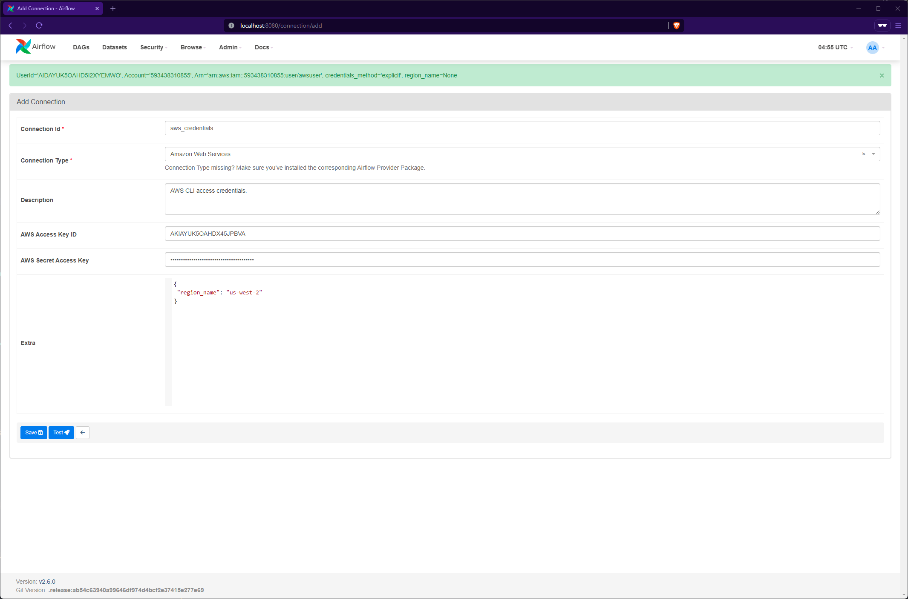
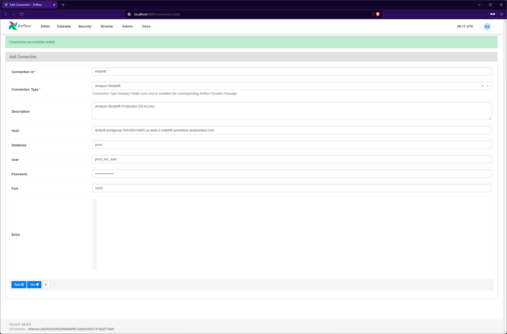
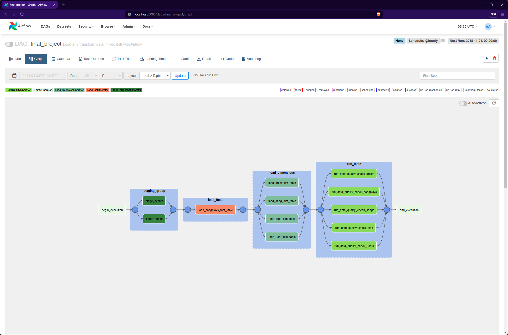
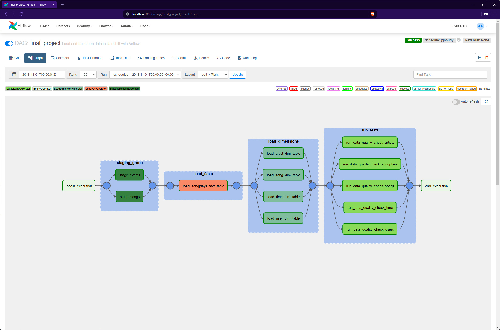

# Project Overview

# Procedure
## 1. Upload raw data to s3

First, the raw data must be uploaded to S3. A script has been created to perform the necessary actions. Issue the following command from the project's root directory: 
```sh 
sh scripts/upload_data_to_s3.sh
```

*Note:* 
  - The following variables should be changed in the script:
    - `S3_BUCKET` changes the target bucket
    - `PREFIX` changes the path within the bucket. A blank value will default to the root of the bucket.
  - For this project the bucket `aws-dend-airflow` is created and the project data files are copied over.

## 2. Set up Redshift User
For the purposes of this project, a new user is created with access to the `prod` database only. First, create and connect to the `prod` database, then execute the following queries in Redshift:

```sql
-- Create a user. Ensure to change the password
CREATE USER prod_svc_user PASSWORD 'someP@ssw0rd';

-- Grant all privileges to the user, in the context of the prod database.
-- This is required for certain dag/task operations.
GRANT ALL ON ALL TABLES IN SCHEMA public TO prod_svc_user;
```
## 3. Deploy Airflow
A docker compose file is provided to quickly spin-up an Airflow instance. Enter the project's directory, and run `docker compose up -d`. Once deployed, the application can be accessed at `localhost:8080`.

## 4. Add connections to Airflow
Under 'Admin -> Connections' add the relevant entries for:
 - AWS CLI access, and 
 - Redshift access with the previously created user.

*Notes:* 
- Connection testing is enabled in the docker compose file; be sure to test the connections before saving them.
- Specify the region_name for the AWS CLI credentials
- Specify the target database in the Redshift connection - DAG tasks will operate on this target. For each target database, create a new connection.

<details>
  <summary>Airflow Connections</summary>
    <figure>
      
      <figcaption style="text-align:center;">AWS Connection in Airflow</figcaption>
    </figure>
    <figure>
      
      <figcaption style="text-align:center;">Redshift Connection in Airflow</figcaption>
    </figure>
</details>

## 5. Run the DAG
The dag is named `final_project` and can be enabled from the DAGs menu. By default, the DAG is configured to run only for the date range of the data provided in the project, i.e. '2018/11'. It is configured to utilize the execution time and parse the year and month, however the default execution will only run for the aforementioned date.

<details>
  <summary>DAG Execution</summary>
    <figure>
      
      <figcaption style="text-align:center;">DAG Execution Plan</figcaption>
    </figure>
    <figure>
      
      <figcaption style="text-align:center;">Successful DAG Execution</figcaption>
    </figure>
</details>

# Dev Notes
### Operators

`StageToRedshiftOperator`: This operator stages data from S3 into a table in Redshift.
- To avoid errors, ensure that the staging table exists in Redshift prior to running.
- The default S3 key is compiled from the execution date in the format of YYYY/MM (e.g. s3://some_bucket/2018/11/). This isn't always useful as you'd likely want to specify an s3 key after the bucket name; therefore you have the option to template this parameter as follows: `s3_key = some_key/{{ execution_date.strftime("%Y/%m") }}`, resuling in a path like s3://some_bucket/some_key/2018/11.
- redshift_conn_id and aws_credentials_id have defaults, but it is recommended that these be set anyway.

`LoadFactOperator`: This operator only allows for append-style operations on tables.
- Takes as input the target table and a sql query string.
- Duplicate entries will be ignored, by default; this does not handle any upserts.

`LoadDimensionOperator`: This operator handles dimension table operations. Notably, it differs from the fact table operators by allowing either truncate-insert (default) or append-style operations on the dimension table.
- Takes as input the target table and a sql query string.
- Switch between truncate-insert and append-style by setting the `truncate` flag to `True` or `False`, respectively.

`DataQualityOperator`: This operator performs unit tests on the tables. For robustness, it takes in a SQL string to execute, the table, and a test function - this way the test logic is decoupled from the operator.
- The test function should take as a parameter the result set of the sql query. See [tests](#tests) below to understand how tests can be created.
- By default, if no test function is provided this operator will return `True` for the test function, so be sure to provide a test function. The [`TestSuite`](./plugins/test_suite/test_suite.py) class is a good place to start.
- The sql string should utilize templates for the table name (e.g. `"SELECT * FROM {table}"`)
- A target table must be provided.
- *Note:* This operator can be modified to perform more robust templating. For now, it provides only basic templating functionality for the table name.

### Tests
Test logic is separated from operator logic by utilizing test classes. These are found under the [test_suite folder](./plugins/test_suite/). By default, a `TestSuite` class is provided with a simple row count test. It is fairly straightforward to extend this class with other tests, by following the query-test function pattern:

`row_count_test.sql`: The templated sql string to be executed

`row_count_function`: The unit test function.
- Takes as input the result set from the corresponding sql query. 
- It must either raise and error or return `False` if the test fails, and `True` if the test passes.
- By default, the `DataQualityOperator` will return `True` for all tests, so make sure to be explicit here.
