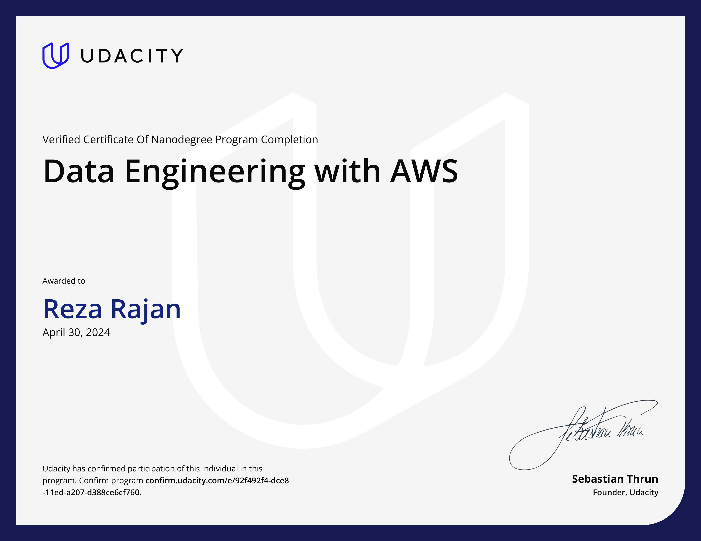

# Udacity Data Engineering Nanodegree

This repository serves as a portfolio of projects done for the [Udacity AWS Data Engineer Nanodegree](https://www.udacity.com/course/data-engineer-nanodegree--nd027).

---
## Project Overview
### 1 - [Data Modelling with Apache Cassandra](projects/1%20-%20Data%20Modelling%20with%20Apache%20Cassandra/)
A startup called Sparkify wants to analyze the data they've been collecting on songs and user activity on their new music streaming app. The analysis team is particularly interested in understanding what songs users are listening to. Currently, there is no easy way to query the data to generate the results, since the data reside in a directory of CSV files on user activity on the app.

They'd like a data engineer to create an Apache Cassandra database which can create queries on song play data to answer the questions, and wish to bring you on the project. Your role is to create a database for this analysis. You'll be able to test your database by running queries given to you by the analytics team from Sparkify to create the results.

Skills Tested:
- CQL
- Python
- NoSQL Data Modelling

### 2 - [Data Warehouse](projects/2%20-%20Data%20Warehouse/)
A music streaming startup, Sparkify, has grown their user base and song database and want to move their processes and data onto the cloud. Their data resides in S3, in a directory of JSON logs on user activity on the app, as well as a directory with JSON metadata on the songs in their app.

As their data engineer, you are tasked with building an ETL pipeline that extracts their data from S3, stages them in Redshift, and transforms data into a set of dimensional tables for their analytics team to continue finding insights into what songs their users are listening to.

Skills Tested:
- SQL
- AWS Redshift
- Python (boto3)
- Dimensional Data Modelling

### 3 - [STEDI Human Balance Analytics](projects/3%20-%20STEDI%20Human%20Balance%20Analytics/)
The STEDI Team has been hard at work developing a hardware STEDI Step Trainer that:
- trains the user to do a STEDI balance exercise;
- and has sensors on the device that collect data to train a machine-learning algorithm to detect steps;
- has a companion mobile app that collects customer data and interacts with the device sensors.

As a data engineer on the STEDI Step Trainer team, you'll need to extract the data produced by the STEDI Step Trainer sensors and the mobile app, and curate them into a data lakehouse solution on AWS so that Data Scientists can train a machine learning model.

Skills Tested:
- AWS Glue
- AWS Athena
- Spark (pyspark)
- Architecting a Data Lakehouse

### 4 - [Data Pipelines](projects/4%20-%20Data%20Pipelines)
A music streaming company, Sparkify, has decided that it is time to introduce more automation and monitoring to their data warehouse ETL pipelines and come to the conclusion that the best tool to achieve this is Apache Airflow.

This project focuses on creating a high grade data pipeline that is:
- built from reusable tasks
- allows monitoring
- enables backfills
- performs data quality checks following ETL

Skills Tested:
- Apache Airflow
- Amazon Redshift
- ETL Pipelines

---
## [Certificate of Completion](./docs/certificate.pdf)

